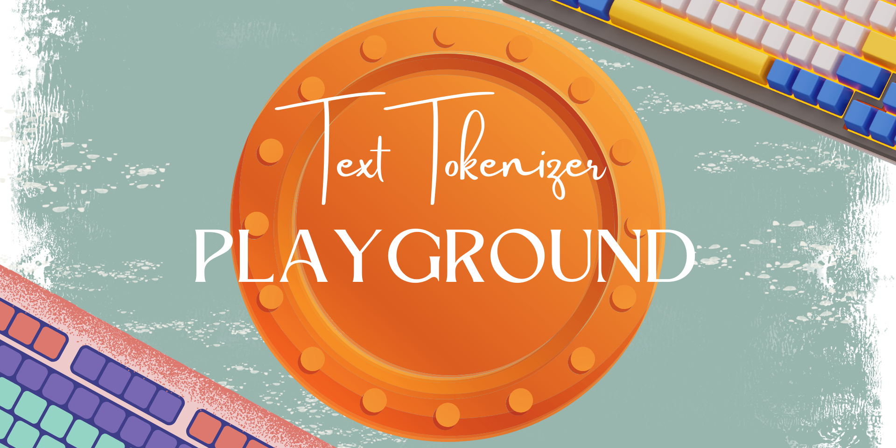
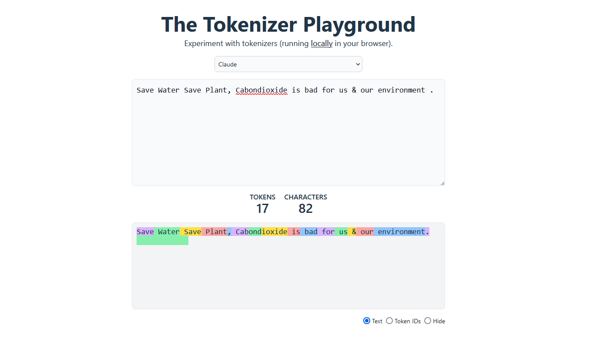

🪶Check out the configuration reference at https://huggingface.co/docs/hub/spaces-config-reference

🚀Huggingface space : https://huggingface.co/spaces/prithivMLmods/Text-Tokenizer-Playground

🚀To Clone Just Install Git Past the Command : git clone https://huggingface.co/spaces/prithivMLmods/Text-Tokenizer-Playground

ℹ️Generated Result in Huggingface Spaces:

ℹ️Text Tokenizer Inference

.

.

.
